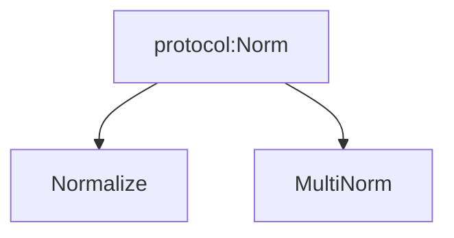

# Matplotlib Weekly Meeting: June 2025

###### tags: `2025 dev call`

---

# June 5, 2025

_attending_: @tacaswell, @ksunden, @efiring, @story645, @trygve, @QuLogic, @timhoffm 
## Agenda

### Old Business
- [x] RSE updates
- [x] font updates

### New Business
- [x] [name=hannah] triage nomination project board
- [x] [name=QuLogic] [Type 1 subsetting tests](https://github.com/matplotlib/matplotlib/pull/20716#issuecomment-2942877182)
- [x] [name=ksunden] containers in main

## Notes
### RSE updates
 - Kyle:
     - playing around with integrating data-prototype work into core
     - can we merge just the container part
     - attended new contributor meeting (though only Melissa was there)
     - Logistics for SciPy Travel
 - Elliott
     - font!s
     - bit of triage, some hatching
 - Tom
     - just some review

### fonts
- now have a project board: https://github.com/orgs/matplotlib/projects/7
- have a long-lived feature branch on main repo
    - commit the images changes "as we go", but rebase to have all changes it the last commit
    - locked so that only Elliott can merge to it

### triage nomination project board
- Will defer process discussion until we have Melissa available

### font subsetting testing
- go with option 3 (only install fonts on some runners)

### multinorm

- maybe do not inherent from Normalize
 - protocol or ABC
- does usin a protocol have implecations for our use of type stubs
    - no

### containers on main
- can get a number of nice features from just the container half of dataprototype work
    - allows for pulling data on demand rather than needing it all in memory
- only need just enough of the pipelines for query to work
- goal is maintain full back-compatiblity
    - roll out w/ native matplotlib artists 
- do not expand the scope of things that are "mapped"
- leverage the data kwarg to reuse datacontainers/pass container across functions 
- creates a uniform interface for data -> (units, color, etc)
- moves the data attributes off the artist (line.data.x/line.data.y) into a container object 

---

# June 12, 2025

## Agenda
_attending_: @tacaswell, @efiring, @ksunden, @story645, @timhoffm, @QuLogic, Kari Hall, Kamila Stepniowska

### new business
- [ ] NF Code of Conduct onboarding meeting (NF coming to our meeting)

## Notes
### Code of Conduct

- summary of recommendation vs decision modes
    - notifying NumFocus that matplotlib is using decision mode
- need a charter document for  delegating some decision making/enforcement authority to mods/maintainers 
    - NumFocus will share boilerplate
- Decision process purposefully keeps Matplotlib out of the loop
    - NumFocus potentially looping in project when conflict resolution is necessary 
        - option to opt in project leadership to who was in involved + outcome
        - NumFocus would already loop in when Matplotlib needs to enforce decision (banning, losing commit rights, etc)
- To do: 
    - update goverance + add charters for moderator 
    - then pull request new CoC

- Summary/meta information about reporting at end of year (modeled on PSF)

---

# June 19, 2025

## Agenda
_attending_: @tacaswell, @ksunden, @QuLogic, @efiring, @story645  

### Old Business
- [ ] RSE updates
- [ ] font updates

### new business
- [ ] [name=hannah][norm: protocol vs ABC](https://github.com/matplotlib/matplotlib/pull/30149#issuecomment-2988318982)
## Notes
### RSE updates
- Kyle:
    - preparing for scipy, finishing up travel/poster
    - attened ML / pixi to manage the environments to do it
    - issue review
- Elliott:
    - mostly review
    - font stuff is waiting for review
    - looked at color emoji 
        - some fonts provide svg for emoji as latest iteration of how to do color
- Tom:
    - not much time this week
    - looking 

### norm: ABC vs protocol
- ABC is a stronger communication of interface, 
    - forced to implement abstract methods
- Protocols 
    - aren't forced to implement abstract methods 
    - good for many small coupled interfaces instead of multiple inheritance
        - Possibly replacing artist with a half dozen protocols: alpha protocol, colorizer protocol,
        - backends: blitting protocol
    - extensive duck typing

- subjective view of simpler:
    - no metaclass + no binding to specific inheritance tree 
    - ABC is simpler, is straightforward traditional class inheritance

- no compelling technical argument in either direction 
- norm will blow up if methods aren't present and matching signature 
- is instance(ABC) works, is faster than for protocols
- is instance w/ protocols is a runtime checkable thing that does subclass check for presence of method and static type checking for signature match
    - allows more control of what's exposed to runtime checking
- ABCs will yell at class instantiation time, protocols better integrated with static type checking
 
- Summary
    - both will work fine, ABCs are status quo, don't expect multiple implementations which is where differences are expected to matter

---

# June 26, 2025

## Agenda
_attending_:
- [x] RSE updates
- [ ] font updates

## Notes
- @ksunden poster got bumped to talk so refocusing efforts there
    - maybe practice talk next week
- @QuLogic mostly review backlog
    - some typing ones for pyplot
    - rebased font PRs (review)
- Did we get linkedin back? 
