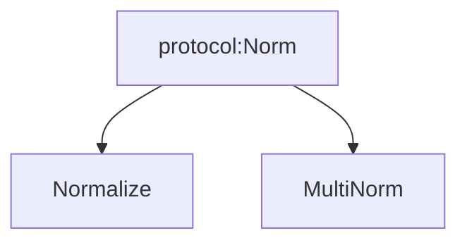

# Matplotlib Weekly Meeting 

**A regular sync meeting for the project's maintainers, which is open to the community.** Everyone is welcome to attend and contribute to conversations.

## Jan 09 2025 - 


###### tags: `2025 dev call`


Call co-ordinates:  Thursdays @ 21:00 (9:00PM) Berlin time (20:00 UTC during winter, **19:00 UTC during summer**)

[<h1 style="text-align: center;">Zoom link</h1>](https://zoom.us/j/384435716?pwd=WFpxVWxoYXArTDFzN1lWaHNoOE8xZz09)

### [Find your time](https://time.is/2100_3_April_2025_in_Berlin/UTC/New_York/MT/Vancouver/Hawaii?matplotlib_weekly_meeting)

**NOTE** Open PR to adjust time next day light savings change, times must be in UTC [scientific python mpl calender entry](https://github.com/scientific-python/scientific-python.org/blob/main/calendars/matplotlib.yaml)


---

Previous notes: [Meeting Agendas](https://hackmd.io/zljR-pZrQ0O5J_j4NZ-9yw)
Archive: [matplotlib/ProjectManagement](https://github.com/matplotlib/ProjectManagement)

#### [projects](https://hackmd.io/@matplotlib/projectslist)

#### [RSE worklog](https://hackmd.io/@matplotlib/HyVoUHlSo)

---
# Sept 4
_attending_: 

## Agenda
 - [ ] RSE updates
 - [ ] [name=hannah] new note?

## Notes

# Aug 28
_attending_: @ksunden @efiring @QuLogic @dstansby @story645

## Agenda
 - [ ] RSE updates
 - [ ] [name=hannah][survey](https://github.com/matplotlib/surveys)


## Notes

RSE updates
- Kyle
    - Image support for data containers on main
    - Prep for 3.10.6 (going through release after meeting, waiting on CI)
- Elliott
    - rebased font property PRs ([#29395](https://github.com/matplotlib/matplotlib/pull/29695) and [#29794](https://github.com/matplotlib/matplotlib/pull/29794)) on top of `libraqm` [#30000](https://github.com/matplotlib/matplotlib/pull/30000) since it's close to complete, so they now show the real new behaviour
    - Also combined all text/font changes into a "mega" branch https://github.com/QuLogic/matplotlib/tree/libraqm-full
    - preparing some accessibility and alt-text changes for PDF

# Aug 21
_attending_: @tacaswell @story645  @QuLogic @ksunden, [@efiring](@QWhXj01mSwmTjk5kN1H_qQ)

## Agenda
 - [ ] RSE updates
 - [ ] font review
 - [ ] 3.10.6
 - [ ] 3.11 progress

## Notes
- investigating coverage and build failures on font branches
- 3.10.6: 
    - [uv error](https://github.com/matplotlib/matplotlib/pull/30394): waiting amend to include uv recommended 

# Aug 14
_attending_: [@efiring](@QWhXj01mSwmTjk5kN1H_qQ), @ksunden, @QuLogic, @tacaswell, @story645 

## Agenda
- [x] [name=hannah] matplotlib linked in (may need @matplotlib.org email)
- [x] RSE updates
- [x] grant updates

## Notes
### linkdin
- the "claim this org" does not work for Caswell
- Hannah will try working with linkdin to get control via customer service
    - update: LinkedIn doesn't have phone support
### RSE updates
 - Tom:
     - off last 6 days
 - Kyle:
    - admin work, review work
    - trying to get images working on main with dataprototype
- Elliott
    - mostly review
    - all font work is done and in PR form
    - starting to put together docs / examples

### Grant updates
- sumbitted NASA Y1 progress report


# Aug 7
_attending_: [@efiring](@QWhXj01mSwmTjk5kN1H_qQ), @ksunden, @QuLogic, @tacaswell, @story645 

## Agenda 
- [x] RSE updates


## Notes
- Kyle
    - finishing up 3.10.5 release
    - some admin things
    - work on data-prototype code in main
- Elliott
    - mostly review
    - minor work on font stuff
    - re-addressing hi-dpi
    - numpy's new release producer (with external repo)
        - https://github.com/numpy/numpy-release
        - release CI in a standalone repo which only release managers have access to
- Tom
    - issue/PR review
    - need to write annual report for NASA

# July 31
_attending_: @efiring, @tacaswell, @ksunden, @QuLogic, @dstansby, @story645 
## Agenda
- [ ] RSE updates
- [x] grant updates
- [x] 3.10.5 is out
- [x] 3.11.0 status
- [x] automation of release work?
- [x] [adopt-a-figure](https://github.com/matplotlib/matplotlib/pull/29855#issuecomment-3137415316)
- [ ] font PR review
- [ ] 3.11 general review

## Notes
### Grant updates
- have a call out on UK for open source support
    - @dstansby has been invited to submit full bid
    - Successful expression of interest bid avaialble at https://github.com/dstansby/SSI-RSMF-round-1-MPL
    - funding is  UK based 
    - focus:
        - data w/ units
        - documentation
        - testing and doc builds optimization/improvement
- No more news on NASA

### RSE updates
 - Tom:
     - some review
     - can reproduce the subprocess on CI hangs
         - may be X11 related and a red herring
 - Kyle:
     - release out today
     - bit of review
     - work on data-prototype
 - Elliott:
     - PR review
     - alt-text work is getting closer
     - font work is stuck waiting for review

### 3.10.5 is out

- glitch in release process made 3.10.4 an orphan
- on pypi, docs build in-progress
- includes critical fix to support 3.14
    - will talk about back-porting further if someone asks and is not able to apply the patch them selves.

### 3.11.0 status
 - waiting for fonts
 - adopt-a-figure 
 - multi-norm

### Automation of release work

- reduce human copy/paste/edit steps
- may spend more time automating the task than the task will take
    - but likely worth it here to reduce steps
- wheel building is automated 
- rest is mostly manual follow steps in [release guide](https://matplotlib.org/devdocs/devel/release_guide.html)
    - automating would allow more explicit/longer commands than in release guide
    - pushing still manual/requires human intervention
    - goal is to mostly automate the github side if things

### adopt-a-figure
- `plt.figure(fig)` to register figures to pyplot 
- left: for high-dpi screens figure keeps getting upcast, process needs to be short-circuited here
- gives a way to reshow a figure
- concern that all figures are having their GUI canvases replaced
    - there are some users who are reaching in and touching the GUI specific objects
- need to make sure that the disconnection is bi-directional

### milestone guidelines
- current released: 3.X.N, 
- next micro:  3.X.N+1
- doc: 3.X-doc 
- next: 3.X+1.0
- next next: 3.X+2.0
- previous: 3.X-1.N+1, 3.X-2.N+1

### font review!
https://github.com/orgs/matplotlib/projects/7

# July 24
_attending_: @tacaswell, @ksunden, @QuLogic, @story645 

## Agenda
- [x] grant updates
- [x] RSE updates
- [x] [name=hannah] https://accessviz.github.io/
- [x] [name=kyle] Archiving old org repos
- [x] [name=tacaswell] 3.10.4 release plans / py314 
- [x] fonts update
- [x] 3.11 timeline
- [x] alt-text status

## Notes
### grant updates
- NASA money is released, working on getting contracts running
### RSE updates
- Tom:
    - grant management
    - some review, GHA hardening follow up
- Kyle:
    - review
    - prepare for 3.10.4
    - will move sphinx-theme to trusted publisher this week
- Elliott:
    - mostly review, get through 3.11 
        - bunch of things need second review
    - may adopt some of Tim's PRs
    - got font collections working (PR is open)
### accessviz
2-4 page position
@story645 will start the repo/draft (is empty at mo
    - https://github.com/story645/accessviz2025 (is empty at moment)

due Jul 27 AOE
### Archiving old org repos

No questions archiving

- natgrid      (Feb 2011)
- sample_data  (Dec 2011)
- fcpy         (Apr 2016)
- freetypy     (Oct 2017)
- mplsizer     (Jun 2018)
- mpl-altair   (Dec 2020)


Contact people before likely archiving
- mpl-finance  (Feb 2020) (replaced by mplfinance with no dash)
- mpl-docker   (Jul 2020)  (installs deps, but not actually mpl)
- grid-strategy (Mar 2020)

Add note of new location (scientific python blog), then archive
- matplotblog  (Mar 2022) (functionally moved to scientific python)


Old tutorials (maybe archive/reference from presentations)

- Getting Started (Jan 2020) (Tutorial for Scipy 2019)
- AnatomyOfMatplotlib (Aug 2021)
- interactive_tutorial (Mar 2021)

Maybe archive, but lean towards keep:

- mpl-bench (Feb 2022)

Start actively using again:

- presentations (Aug 2019)

### 3.10.4 release

with py3.14rc1 out we need to get a 3.14 compatible version released.

just waiting on backport PRs to finish CI and merge

to 3.9.x? Wait for someone to ask

### alt-text work
- have some work-in-progress commits
    - pngs and svgs
        - pngs have a standard 
        - svg wc3 standard
- have not done PDFs yet, but know where to put stuff
- went with simple "add alt text" api, not the full css set of roles

### font work!

- lanugage and font feature in normal API review state
- vector + libraqm can be made to work, but requires a bunch of refactoring
    - will push forward with libraqm without vector support
    - related to sub-setting and our current imlementation works on "characters" not "glyphs"
- see board for review work
- font collection needs some design choices #30334

### 3.11 timeline

- 3.11 goes out when fonts land
    - libraqm
    - alt-text

# July 17
_attending_: @tacaswell @greglucas @ksunden @QuLogic @story645 

## Agenda
- [x] grant updates
- [x] RSE updates
- [x] scipy updates
- [x] font updates
- [x] GHA hardening
- [ ] ~~PR review~~

## Notes
### grant updates
- NASA money for ROSES24 is moving along, now have an agreement
### RSE updates
 - Tom: 
     - some issue/PR review
 - Elliott:
     - review
     - fonts:
         - no range stuff, sort that out later
         - cleanup things to go with font work (deprecated kerning factor etc)
         - most PRs are ready to go
             - libraqm broke PDFs, expect to be fixable
 - Kyle / scipy updates:
     - went to scipy
     - talk about data-container side of data-prototype project
         - some follow up conversations, some positive feedback
         - discussions with data-structure libraries
         - positive feedback on plenary (multi-variable colormaps!)
     - felt smaller than past years
     - ran sprints
         - but only one maintainer and a couple of friends
         
### font updates
- see RSE updates
- maybe look at figure size rounding PR again (as long as we are re-generating images)

### GHA hardening
- want to flip org-level default to be read only
- all matplotlib/matplotlib workflow explict set permissions
    - fallout will fall on other repos
- @tacaswell will reach out to leads of sub-projects and give 1mo to get sorted 

(declared effient meeting and ended early)

# July 10th
## Agenda
_attending_: @tacaswell, @story645, @QuLogic 
- [ ] RSE updates
- [ ] font updates

## Notes
- @ksunden at scipy
- @qulogic will push to his branch to show more of final work 
    - discussion of where FontFeatures should go
        - text vs. fonts -> specifying multiple fonts for a specific text object
        - problem is fonts are adhoc generated as keyword args to text
        - https://github.com/matplotlib/matplotlib/pull/29695#issuecomment-3056289359
    - conclusion: move forward w/ Antony's suggestion applied to all properties 
        - deferred to 3.12
        - avoid documenting range until it's consistent across functions/properties & then expose to user
    - can remove manual meson build for free type


# July 3rd
## Agenda

_attending_: @ksunden, @QuLogic, @trygvard, @story645 
- [x] RSE updates
- [x] font updates

## Notes
- @ksunden preppeing for scipy
- @QuLogic issue triage 
    - particularly focused on font stuff that would get fixed by overhaul

# June 26
## Agenda
_attending_:
- [x] RSE updates
- [ ] font updates

## Notes
- @ksunden poster got bumped to talk so refocusing efforts there
    - maybe practice talk next week
- @QuLogic mostly review backlog
    - some typing ones for pyplot
    - rebased font PRs (review)
- Did we get linkedin back? 

# June 19
## Agenda
_attending_: @tacaswell, @ksunden, @QuLogic, @efiring, @story645  

### Old Business
- [ ] RSE updates
- [ ] font updates

### new business
- [ ] [name=hannah][norm: protocol vs ABC](https://github.com/matplotlib/matplotlib/pull/30149#issuecomment-2988318982)
## Notes
### RSE updates
- Kyle:
    - preparing for scipy, finishing up travel/poster
    - attened ML / pixi to manage the environments to do it
    - issue review
- Elliott:
    - mostly review
    - font stuff is waiting for review
    - looked at color emoji 
        - some fonts provide svg for emoji as latest iteration of how to do color
- Tom:
    - not much time this week
    - looking 

### norm: ABC vs protocol
- ABC is a stronger communication of interface, 
    - forced to implement abstract methods
- Protocols 
    - aren't forced to implement abstract methods 
    - good for many small coupled interfaces instead of multiple inheritance
        - Possibly replacing artist with a half dozen protocols: alpha protocol, colorizer protocol,
        - backends: blitting protocol
    - extensive duck typing

- subjective view of simpler:
    - no metaclass + no binding to specific inheritance tree 
    - ABC is simpler, is straightforward traditional class inheritance

- no compelling technical argument in either direction 
- norm will blow up if methods aren't present and matching signature 
- is instance(ABC) works, is faster than for protocols
- is instance w/ protocols is a runtime checkable thing that does subclass check for presence of method and static type checking for signature match
    - allows more control of what's exposed to runtime checking
- ABCs will yell at class instantiation time, protocols better integrated with static type checking
 
- Summary
    - both will work fine, ABCs are status quo, don't expect multiple implementations which is where differences are expected to matter
    - 

# June 12
## Agenda
_attending_: @tacaswell, @efiring, @ksunden, @story645, @timhoffm, @QuLogic, Kari Hall, Kamila Stepniowska


### new business
- [ ] NF Code of Conduct onboarding meeting (NF coming to our meeting)

## Notes
### Code of Conduct

- summary of recommendation vs decision modes
    - notifying NumFocus that matplotlib is using decision mode
- need a charter document for  delegating some decision making/enforcement authority to mods/maintainers 
    - NumFocus will share boilerplate
- Decision process purposefully keeps Matplotlib out of the loop
    - NumFocus potentially looping in project when conflict resolution is necessary 
        - option to opt in project leadership to who was in involved + outcome
        - NumFocus would already loop in when Matplotlib needs to enforce decision (banning, losing commit rights, etc)
- To do: 
    - update goverance + add charters for moderator 
    - then pull request new CoC

- Summary/meta information about reporting at end of year (modeled on PSF)


# June 5th
_attending_: @tacaswell, @ksunden, @efiring, @story645, @trygve, @QuLogic, @timhoffm 
## Agenda

### Old Business
- [x] RSE updates
- [x] font updates


### New Business
- [x] [name=hannah] triage nomination project board
- [x] [name=QuLogic] [Type 1 subsetting tests](https://github.com/matplotlib/matplotlib/pull/20716#issuecomment-2942877182)
- [x] [name=ksunden] containers in main


## Notes
### RSE updates
 - Kyle:
     - playing around with integrating data-prototype work into core
     - can we merge just the container part
     - attended new contributor meeting (though only Melissa was there)
     - Logistics for SciPy Travel
 - Elliott
     - font!s
     - bit of triage, some hatching
 - Tom
     - just some review

### fonts
- now have a project board: https://github.com/orgs/matplotlib/projects/7
- have a long-lived feature branch on main repo
    - commit the images changes "as we go", but rebase to have all changes it the last commit
    - locked so that only Elliott can merge to it

### triage nomination project board
- Will defer process discussion until we have Melissa available

### font subsetting testing
- go with option 3 (only install fonts on some runners)


### multinorm

- maybe do not inherent from Normalize
 - protocol or ABC
- does usin a protocol have implecations for our use of type stubs
    - no



### containers on main
- can get a number of nice features from just the container half of dataprototype work
    - allows for pulling data on demand rather than needing it all in memory
- only need just enough of the pipelines for query to work
- goal is maintain full back-compatiblity
    - roll out w/ native matplotlib artists 
- do not expand the scope of things that are "mapped"
- leverage the data kwarg to reuse datacontainers/pass container across functions 
- creates a uniform interface for data -> (units, color, etc)
- moves the data attributes off the artist (line.data.x/line.data.y) into a container object 

# May 29
_attending_: @efiring @ksunden  @story645 @QuLogic 
## Agenda

### Old Business
- [ ] RSE updates
- [ ] font updates

### New Business
- [ ] [name=hannah] triage nomination project board
    - wait til next week

## Notes
- @ksunden prepping presentation
    - organizing thoughts on data prototype stuff
- @QuLogic more font work
    - libraqm is nearly there
        - has working for raster backends
        - needs another PR for vector backends 
        - two stacked prs: freetype + libraqm 
            - freetype is giant b/c also has everything that needs to rebuild images  
    - debating changing how this review stuff is going 
        - maybe do everything targeting a feature branch 
            - shouldn't have heavy rebase issues b/c kinda standalone
            - advantage is that image changes can be per pr rather than 1 big PR 
                - 2 commits per pr - 1 w/ test related image changes, 2 w/ all changes, merge 1st commit into feature branch 
    - add a PR for pdf/ps side of things   
    - PR count: @QuLogic has 4, @anntzer has 3 (2 are subsumed into freetype PR), jouni has a pdf one
        - https://github.com/matplotlib/matplotlib/pull/30059 drop intermediate buffer is priority
        - freetype, libraqm
    - Freetype PR
        - 12 commits
        - 2 will be replaced by #30059
        - 4 are updating tests (could be contained to one PR)
            - about 50 images change cause of kerning and ligarature (libraqm)
        - 1 updating to freetype
        - updating kerning and text hinting factor
        
# May 22
## Agenda
_attending_: @efiring, @greglucas, @QuLogic, @ksunden, @trygve, @story645 

### Old Business
- [x] RSE updates
- [x] font updates
- [x] [name=hannah]New Contributor meeting

## Notes
### New Contributor Meeting June 3rd
- @story645 needs someone to cover 'cause Jewish holiday 
- will send @ksunden an invite
- @melissawm said she can cover

### RSE updates
@ksunden was at scientific python summit
- lots of discussions on cross project compataibility, particulary on scalers vs. 0D arrays
- standardizing on what ArrayLike means
- spent time thinking on interactive tutorials tooling 
    - https://github.com/scientific-python/executable-tutorials
    - Serving here: https://scientific-python.github.io/executable-tutorials/
    - having a set of markdown based jupyter notebooks 
    - CI/CD type things, deployed to website + jupyterlite online + jupyter locally
        - https://scientific-python.github.io/executable-tutorials/
        - inline jupyterlite/executable
        - https://github.com/matplotlib/matplotlib/pull/29506

@QuLogic 
- updated WASM CI https://github.com/matplotlib/matplotlib/pull/29093
    - plan to move to project builds 
- font work 
- removing the intermediate buffer allows for color support (intermediate is in gray school)
    - mplcairo doesn't use ft2font
- plan for fonts is individual commits + image updates on last commit
- alt text PR is targted for 3.11
- potentially get a couple of font formats in as part of ongoing work

@greglucas plans to start grant work


### Funding page/funding acknowledgements
- Discussion of steering-council to create that page
    - large-scale acknowledgement of grants, including grant numbers.
    - do gsoc and gsod count
    - do we list numfocus small dev grants
    
- debate about whether now might be a good time to have it b/c could be seen as partisan 
- can also send stuff to numfocus for their announcements/annual reports/blog posts
- @greglucas will send email to steering-committee about it 


### Multinorm

- https://github.com/matplotlib/matplotlib/pull/29876
- then plotting functions: https://github.com/matplotlib/matplotlib/pull/29221
- then needs colorbars function -> aim is for next next release
- [x] @story645 will ask for trygve to get triage rights


# May 15
## Agenda
_attending_: @tacaswell, @QuLogic, @story645 
### Old business
- [x] RSE updates
- [x] font updates

### New business
 - [ ] public aria API

## Notes
### RSE updates
 - Kyle:
     - at scientific-python summit this week
 - Tom:
     - some review
 - Elliott:
     - fonts
     - alt text

### font stuff 
- #29816 will be a huge PR where commits are stacked 
    - is just freetype + other changes independent of libraqm 
    - change hinting factor from 8 to 1, means images change here and not w/ libraqm 
- font features/language changes are API changes/independent
    - should land before libraqm but needs a test font 
    - same alphabet set, English has ligatures but not German
- libraqm 
    - requires less image changes
- freetype in limbo b/c of @anntzer's feedback
- maybe add an rc_param for ligatures 
- todo: pulling up more than one font from file
- adding superfamilies - needs design discussion 
- alpha compositing [#30043](https://github.com/matplotlib/matplotlib/pull/30043)
    - should have reference for where math/procedure comes from
    - smoother alpha compositing between adjacent glyphs


### aria api
- https://github.com/matplotlib/matplotlib/pull/21328
    - add aria properties to artist
        - set_aria and take a blind dictionary, do we want to validate to known aria types
        - maybe validate if keys are allowed to take values/ validate values when possible
        - in documentation add that this is for downstream consumers, we only use to pass along to filemetadata
    - do we want to fail/accept/warn? 
    - depends on how fast the standards move 
    - dateelements property in html -> free form dictionary 
    - look at attributes rather than roles, 
- https://github.com/highcharts/highcharts/tree/master <- is apparently very good at accessibility 
- stash alt_text on file metadata (png on info/text)
- how is update managed [comment](https://github.com/matplotlib/matplotlib/pull/21328#discussion_r1025694368)
- [widget](https://matplotlib.org/devdocs/gallery/widgets/index.html) - don't expose enough information for gui to use the information
    - GUI toolkits render as rgba buffer
    - missing focus + exposure of internal state
    - tracks click through and updates png, can't tab to keyboard (GUI doesn't know it's a widget)
    - add note about how our widgets are not accessible widgets, you need to use a GUI toolkit library for that 
- svg can get all the things, static aria description is analog to alt text
- aria label is more about image + text, described by element 
    - telephone icon + telephone text -> description for icon comes from text
    - description - describing things about element 
    
# May 8
## Agenda
_attending:_ @tacaswell, @efiring, @QuLogic, @ksunden, @story645 

### old business
 - [x] RSE updates
 - [x] font stuff
 - [x] [name=hannah] CoC adoption timeline 
     - missed end of April deadline, next deadline is September

### New business
- [ ] affliation/sponsership (offer from https://www.matplotlib-journey.com/)
    - [ ] how do we feel about non-free external resources?
- [x] py314 compat https://github.com/matplotlib/matplotlib/pull/29393

## Notes
### py314 issue
- go ahead and merge it

### CoC
- submitted form to adopt this round
- consensus of discussions is to go with response as the option

### RSE updates
 - Kyle
     - gotten 3.10.3 out, docs need to rebuild
     - planning meeting for summit next week
     - data prototype communication / presentation work
 - Elliott
     - fonts!
     - intra-PR review of code from Antony
     - have full implemetantion of libraqm with font features + language
     - PR with libraqm (just core, not features + language)
 - Tom
     - mostly swamped with other work

### fonts
 - incorperating Antony's changes
     - place mathtext from the bottom rather than top
 - remove some back-compat to reporduce bugs from ttconf (that we no longer use)

### affiliation 
- what is the ask? 
- adding paid training to external resources w/o tracking (just kick back an optional contribution)
- endorsement: adding to our page fine, us on their page would be very high bar
    - adding to our page might need some kind of bar

## Notes

# May 1
## Agenda
_attending:_ @ksunden, @[anntzer](pXw4hSgTQF2--OciPYwa1w), @trygve, @QuLogic, @story645 

### old business
 - [x] RSE updates
 - [x] font stuff
 - [x] [name=hannah] CoC adoption timeline 
     - missed end of April deadline, next deadline is September

### New business

## Notes
### CoC
- needs timeline for pr/public comment period
    - soft consensus towards independent arbitrator
### Font/RSE
- fonts waiting on some small things from @anntzer + @QuLogic 
    - 18181 may have backcompat code that needs to be removed
    - needs review: [mapping of dvi glyph indices to freetype indices](https://github.com/matplotlib/matplotlib/pull/29829)
    - timeline for freetype migration
        - aim for 3.10.{2,3}
- PEP 735 (dependency groups) now implemented in PEP
    - please try/review [#29281](https://github.com/matplotlib/matplotlib/pull/29281)

### 3.10.x/RSE
- waiting on release critical draft PR: [deep copy](https://github.com/matplotlib/matplotlib/pull/29393)
    - don't know if Python is keeping the change that motivated this PR or has suggested work arounds
- CI build release broken
    - need to investigate which backports are failing tests
    - some PRs that need to be merged: https://github.com/matplotlib/matplotlib/pulls?q=is%3Aopen+is%3Apr+milestone%3Av3.10.2

### RSE
- Kyle admin around summit


# April 24
## Agenda
_attending:_ @QuLogic @ksunden @QWhXj01mSwmTjk5kN1H_qQ @story645 @tacaswell 
### old business
 - [x] RSE updates
 - [x] font stuff

### New business

## Notes
### RSE updates
 - Kyle:
     - work on getting data-prototype on pypi
         - some churn due to renaming (mpl-data-containers)
 - Elliott
     - font stuff
     - rebased freetype (again) as all the place-holder stuff is in
     - only one new issue in that the kerning looks off in someplaces
         - spacing between a 't' and 'e' is off, reverts back to correct with libraqm 
     - fixed a bug in mathtex
 - Tom
     - some review, mostly other responsibilities this week


### fonts
- looking good
- @story645 will provide hebrew text to add to test image
- still need to look into the the above discussed kerning between t and e


# April 17
## Agenda

_attending:_ @QuLogic @ksunden @tacaswell @story645 

### Old business
 - [x] RSE updates
 - [x] grant updates
 - [x] freetype migration
 - [x] mpl-gui integration progress


## Notes
### RSE updates
 - Kyle: data-prototype stuff, goal is on pypi tomorrow
 - Elliott: 
     - mostly font stuff
     - updated PR enabling windows on arm (public beta on arm runners), no numpy wheels yet, so we are not running tests yet
     - rebased freetype PR again
     - found another old bug that Mike had already written a patch for
     - moved language to text objects
 - Tom: some issue / PR review, trying to drop py310

### Freetype migration
- still going
- computer modern alphabet looks a bit worse, but not sure if it appears in real words

### last-resort font
- needs review + bump font cache number

### mpl-gui 

- still agreement we liked last week's consensus

# April 10
_
## Agenda
_attending:_ @QuLogic @ksunden @tacaswell @story645 @QWhXj01mSwmTjk5kN1H_qQ (@efiring)

### Old business
 - [x] RSE updates
 - [x] grant updates
 - [x] ultimate fallback font

### New business
- [x] mpl-gui integration
- [ ] tex work
- [x] drop py3.10 support

## Notes
### RSE updates
 - Tom: healthy again
 - Kyle: image support in dataprototype + inspection tools
 - Elliott: mostly text stuff
     - 29872 -> decorator to replace text with rectangle to buffer from font rendering changes
    - rebased freetype 2.13 PR again
    - found one more place we need to thread passing `Text` object through apis 
### Grant updates
 - none

### last-resort fallback font
 - just needs review

### drop 3.10
- we should do it on our schedule
- https://github.com/matplotlib/matplotlib/pull/29840 is (closed) PR from running a tool that was a bit more churn than we wanted
- mostly minor cleanup changes, no major new language features
- main work to do is rip out CI + metadata

### mpl-gui [#29836](https://github.com/matplotlib/matplotlib/pull/29836)
- big picture: do we want this at all (what problems are we trying to solve):
    - pyplot state/object stateless interface mixing
        - unclear what's being tracked and what's not being tracked (what needs to be garbage collected?)
        - consensus is towards minimal changes 
- questions about naming / transition plans (in mpl-top level?, get its own?)
    - pro of being in own namespace:
        - gives future path of doing "now recommended thing"
        - need to 
    - shim it underneath pyplot (pyplot manages everything) + own namespace where user manages everything
    - put "nice" helpers in `mpl` to get Figure + Axes sets which never gets a GUI + import display to display 
- current behavior in Matplotlib:
    - plt.figure() -> creates GUI + registers with our global state
    - Figure -> untracked figure object (normal Python gc rules)
        - picks right backend on save
        - no way to show via current machinary
    - minimal change is to:
        - add way to register figure to pyplot ``plt.{adopt, add, register}_figure``  and/or ```plt.show([list of figures])```
            - what's the priority queue for figures added to registry + added in show?
                - show 'em all vs. show list of figures  (maybe keyword or positional arg)
                - no duplicates 
        - seperate figure creation from state management
        - make a figure active via `plt.figure(fig)` b/c fig is currently a creation + retrievial API 
- mpl-gui layers
    - promotion machinary that matches figure object w/ approprirate figure canvas
    - display: pass list of figure objects that it attaches GUI too, then runs event loop until dead
    - state management (context manager): with figure(): -> calls display after the figure
    - global registry (implemented like plt.ion by adapting a context manager)
 - mpl & mpl-gui seperation of responsibilities:
     - mpl: figure/subplot/etc creation helpers, 
     - mpl-gui: implementation of registeries/promotion stuff/etc, figure registeries 
     - pyplot uses mpl gui (mpl-gui is akin to _pyplot)


#### conclusions
- go with minimal apporach
- make it possible to (via `plt.figure`) register a "free" Figure with pyplot
- make `plt.show()` take a list of Figure objects that it will arrange to be shown
- declare victory for 3.11
- mpl-gui stays as a radical experimental project

# April 3
_attending:_ @QuLogic, @tacaswell, @ksunden, @efiring, @story645 
## Agenda
### Old Business
 - [x] RSE updates
 - [ ] Grant updates
 - [x] freetype upgrade
 - [ ] ultimate fallback font
 - [x] font shaping work
 
### New business
 - [ ] mpl_gui integration
 - [ ] tex work

## Notes
### RSE updates
 - Tom: not much due to personal contraints
 - Kyle: working on improving the visualization of the graphs in the artists that can be explained to someone else
 - Elliott: font stuff. have libraqm working in all cases including pdf/ps. still working on ligatures.  Can get same results as before, but new stuff is broken

### Fonts!
- https://github.com/matplotlib/matplotlib/pull/29827 (remove images)
- https://github.com/matplotlib/matplotlib/pull/29816 (update freetype)

Take advantage of regenerating all of the images to remove a bunch of "back-compat" settings (hinting and kerning_factor).

- https://github.com/matplotlib/matplotlib/pull/29356 (last resort)

Long discussion about where to put features and languages

- https://github.com/matplotlib/matplotlib/pull/29695 (font features)
- https://github.com/matplotlib/matplotlib/pull/29794 (add language parameter)

Came to conclusion to put both on the `Text` object and require backends to
pull language/feature information from that.

Only do `Text` object level granularity for now (and open an issue to implement sub-string application)

# March 27
_attending_: @ksunden, @efiring, @QuLogic, @anntzer , @story645 

### Old business
 - [ ] RSE updates
 - [ ] grant updates

### New business
- https://github.com/matplotlib/matplotlib/pull/29807

### Notes
- kyle: mostly data prototype stuff
- Elliot: freetype/text work 


### March 20th
_attending_: @ksunden, @efiring, @ksunden, @story645 

### Old business
 - [x] RSE updates
 - [x] grant updates

### Notes
- [cve against freetype](https://nvd.nist.gov/vuln/detail/CVE-2025-27363) - fixed in 2.13.3
    - not sure if mpl is affected b.c. don't support the features being exploited
- plan is to transition to new freetype 
    - need new tests b/c can't do blanket tolerance update  
- 
### move release managers listing
- move listing of release managers from [governance](https://github.com/matplotlib/governance/pull/41) to: 
    - top of [release manager](https://matplotlib.org/devdocs/devel/release_guide.html)
    - top of https://matplotlib.org/devdocs/users/next_whats_new.html
- link/embed release manager info from release guide 


### March 13th 
_attending_: @story645 @efiring @ksunden @timhoffm 

### Old business
 - [x] RSE updates
 - [x] grant updates
 - [x] [name=hannah] numfocus coc: 
    - recommend or response version? From Kamila (Numfocus):
        - **response**: "NF CoC WG will handle communication with the reporter and reported person. Any bans, or permissions restrictions would be rather on Project's since NF CoC WG will not have a physical possibility to do that. In some cases NF CoC WG would also need some help from a Project to contact the reported person, since they might not have a contact." "your community is obligated to implement the WG decision."
        - **recommend**: "all the actions and communication with reported and reporting person is done by a Project", "The main argument here is that the report will be worked on by an external, independent, trained Working Group."   you just need to acknowledge that you received the recommendations and you will consider them." "There is no defined path for what would happen if the decision would not be implemented. It's a matter for discussion. 
     

    
### New business 
## Notes

### COC

Underlying questions: 
- Do we trust Numfocus to handle this well?
- If we were doing it ourselves, or would want to handle things differently, how different would the outcomes be?

Numfocus modes:
- response:
  - pro: we as a project don't have to deal with it: we don't have to set up rules and procedures how to handle CoC issues
  - pro: we are not experts and can delegate appropriate handling of the topic to a third party (like we do with legal stuff)
  - pro: having a third party handling this removes possible conflict of interest
  - con: concern is that recommendations won't align w/ projects values 
  - con: Project is yielding what might be viewed as a responsibility.
- recommend: 
     - needs codification/process for communicating decision w/ reporter + reportee + process (w/justifications) for amendments
    - Whole process could be slower. Does that make for a better outcome, or worse, on balance?

Proposal 1: go with response; if it doesn't work out, switch to recommend, or ditch Numfocus COC help.

Proposal 2: go with recommend; if it becomes a burden or causes problems, switch to response.

### March 6th
_attending_: @tacaswell, @efiring, @rcomer, @ksunden, @story645 

### Old business
 - [x] RSE updates
 - [x] grant updates
 - [x] [name=hannah] numfocus coc: 
    - recommend or response version?
        - response - numfocus working group manages consequences & enforcement
        - recommend - matplotlib COC commitee manages consequences & enforcement  (WG gives recommendations)
    - multiple projects want clarity on moderation guidelines, Numfocus suggests using online event guide for now

### New business 
## Notes
### RSE updates
- kyle
    - scipy talk propsoal in
    - Cleanup of 3.10.1 release (docs/announcement/etc)
- elliott
    - on vacation!
- tom
    - some review

### CoC updates
 - two modes of opting-in
     - respond
     - recommend
 - discussion of prompt moderation is a common discussion across projects
     - one way to think about this is all maintainers are delegated "event staff"
     - NF is working on clarifying guidance for this


# Feb 27
_attending_: @tacaswell @ksunden @trygvrad @story645 @QuLogic 

## Agenda
### Old business
 - [x] RSE updates
 - [x] grant updates
 
### New business
 
## Notes
### RSE updates
- Elliott
    - fonts!
        - libraqm working except for font fallback
        - 2 PRs coming setting up features for libraqm
        - last resort font done (but docs are not buliding right)
    - sent mail from discourse to mailtester which reports everything is good
    - off for next 2 weeks
- Kyle
    - 3.10.1 is tagged
        - currently fighting latex doc build
    - working on scipy proposal (now due next week instead of yesterday)
- Tom
    - some review, moving grant paper work along

### scipy
- tutorial?
    - no descion yet


### social media stuff
- no response from linkdin
- bluesky verification is doen


# Feb 20
_attending_: @tacaswell, @ksunden, @trygvrad, @story645 

## Agenda
### Old business
 - [x] RSE updates
 - [x] grant updates

### New business
- [x] NF  CoC update
    - have on-boarded and trained their working group (by ottertech)
    - call to action in March to opt-in (as an existing project)
    - NumFOCUS CoC Information Session Tuesday, March 4th, 8:00 - 9:00 am  PST / 16:00 - 17:00 UTC https://numfocus-org.zoom.us/j/87592551095?pwd=Kcabspakme5pNm3omCvgGP1aAMbCzV.1


## Notes
### RSE updates
- kyle
    - data-prototype work
    - making progress on 3.10.1 release out
- tom
    - grant work
- Elliott
    - webservers cut over to new droplets
     
### grant updates
 - NASA still moving

### CoC
- action in March on our part
- adopting this would be governance change

### PRs

##### multivariate colormapping
- https://github.com/matplotlib/matplotlib/pull/29221
    - aiming for 3.11, 
    - next stages are example/user guide docs + colormaps
    - 


# Feb 13
_attending_: @tacaswell @ksunden @greglucas @story645 @QuLogic @timhoffm 

## Agenda
### Old business
- [x] RSE Updates
- [x] NASA status
- [x] [name=hannah] [bluesky verification](https://bsky.social/about/blog/4-28-2023-domain-handle-tutorial)
    - @matplotlib.matplotlib.org
        - allows for @*username*.matplotlib.org if we wanna allow third party packages to register 
    - @matplotlib.org
        - technically we can do both -> @matplotlib.org doesn't prevent @*username*.matplotlib.org 

### New business

### Issues and PRs
* review backlog:
    - [name=hannah][Fix behaviour of Figure.clear() for SubplotParams](https://github.com/matplotlib/matplotlib/pull/27183)
    - [x] [name=greglucas]Order of setting norm changes depending on colorbar on figure or not https://github.com/matplotlib/matplotlib/issues/29522
    - [x] [name=hannah][hatchcolor in collections](https://github.com/matplotlib/matplotlib/pull/29044) 
        - versioning backends
        - using GraphContext instead of parameter list in `draw_path_collection`
## Notes
### Nasa grant 2024
- still moving (on both sides)

### RSE updates
 - Kyle:
     - still making progress on data prototype work
     - working on organizing, getting everything on one branch
 - Tom:
     - some review
 - Elliott:
     - work on website
     - no complaints about discourse so will turn off old droplet
     - preparing to move main website droplet to f41 (from f39)
     - email sending on discourse
         - had no DMARC records
             - things that go into DNS that say to check other verications (that we do have setup)
         - set DNS to say "please check and report errors"
             - will get reports if it fails

### bluesky
- going with `@matplotlib.org` does not prevent adding user names in the future
- go with the simpler
- @story645 will do bluesky side, @QuLogic will do DNS side

### linkdin
- have a ticket in to get control of matplotlib company page

### order of setting norm changes depending on colorbar on figure or not
- can autoexpansion go into drawing of the images on collection so that it would autoexpand the norm
    - mayb norm?colorbar? fail at drawtime, maybe warning but draw correctly 
        - problem is that colorbar is calling an eager draw_without_rendering? 
            - for calculating the values from the norm 
        - potentially move the autoscale logic out of colorbar into colorizer 
        - or move the computaion/resolution logic to colorbar `.draw`
            - might have singular value problems 
    - Move singular expansion logic on the colorbar over to the Norm autoscaling logic
        - This may impact people who draw images without colorbars because previously the images would choose the "low" color, whereas we would autoexpand symmetrically.
        - Do we have issues with auto-expansion and different scales like a LogNorm choosing the non-center color for a singular norm expansion.
        
### hatchcolor collections
- managing 3rd party backend compatability 
- potentially changing the backend interface w/ a versioning interface 
    - possibly moving towards graphic context dataclass 
    - what would be needed to support more backends? 
        - potentially can transforms be movable? (intermediate layers for supporting 3D?)
            - current backend API has a lot of fallbacks if backend doesn't support more specific method
- discussion continued on PR 


### 3.10.1
- maybe next week 


# Feb 6 
_attending_: [@efiring](@QWhXj01mSwmTjk5kN1H_qQ), @tacaswell, @ksunden, @QuLogic, @story645 

## Agenda 
### Old business
- [x] RSE Updates
- [x] NASA status

### New businesses 
- [ ] [name=hannah][matplotlib linked-in](https://www.linkedin.com/company/matplotlib/)
- [ ] [name=hannah][GSOC decision ](https://github.com/matplotlib/matplotlib/issues/29583)

## Notes
### RSE updates
 - Kyle
     - still chipping away on data-prototype
 - Tom
     - minimal work, paper work is moving
     
- Elliott
    - working on text stuff
    - working on website
        - plausible work
        - updated discourse, caused minor down time
            - old droplet is still running if we need to investigate
            - turn of within a week

### GSOC
- @story645 will email matplotlib-dev to see if anyone wants to mentor, currently does not look like we can support this

### linkd-in 
- @tacaswell will try to get admin access
- @story645 wants access to publish announcements
- 
### bluesky

- @story645 will write up options for domain verification for next week

# Jan 30
_attending_: @tacaswell @pawvelJ [@efiring](@QWhXj01mSwmTjk5kN1H_qQ ) @ksunden @QuLogic @story645 
## Agenda
### Old business
- [x] RSE Updates
- [x] NASA status

### New business
- [ ] [name=hannah] What to do about X (contingent on Pawel attending the meaning)
- [x] [name=tacaswell] wheel policy
    - propsoal: if all our compiled dependencies have have wheels, CIbuildwheel will build it, the build is a reasonable time, and someone asks for it, then we will build that platform.  Tier 1 and Tier 2 platforms we build wheels for (https://peps.python.org/pep-0011/) will block a relaese if the wheel builds are failing, all other platforms do not block a release and wheels may be skipped


## Notes
### Introductions
 - Pawel joined this week
 
### RSE updates
- Kyle
    - rebuilt and republished 3.10
    - continue on data-prototype stuff (mostly line and image so far)
- Elliott
    - took care of Fedora build issues
        - expand tolerances to additional archs, there is PR
    - font work is on going, need to open PRs
        - https://github.com/matplotlib/matplotlib/pull/29356 
- Tom
    - not much, some paperwork

### wheels
- propsoal seems good, @tacaswell will write up

### twitter

- remove icon/demphasize participation on public site but keep status quo
- 

# Jan 23
_attending_: @tacaswell, @efiring, @ksunden, @timhoffm, @scottshambaugh, @story645, @QuLogic, @trygvrad

## Agenda
### Old business
- [x] RSE updates
- [x] NASA status

### New business
- [x] [name=hannah][where to put repllite?](https://github.com/matplotlib/matplotlib/pull/29506)
- [ ] [name=tim] [Grouped bar chart PR #28560](https://github.com/matplotlib/matplotlib/pull/28560) is ready for review
- [x] [name=scott] Numpy vectorization speedups in [3D plot_wireframe #29399](https://github.com/matplotlib/matplotlib/pull/29399) broke some plots. The potential fixes in [#29435](https://github.com/matplotlib/matplotlib/pull/29435) all change the return somehow. Revert? 10x speed difference.
- [x] [name=scott] https://github.com/matplotlib/matplotlib/pull/29287 ready for review
- [x] [name=trygvard] [bivariate/multivariate cmap #29221](https://github.com/matplotlib/matplotlib/pull/29221)
## Notes
### RSE updates
- Kyle
    - more pyplot compatibility with data prototype
    - roll out plan
        - start with separate project on pypi
- Tom
    - some review work, CI work
- Elliott
    - finishing up performance work
        - got 17% memory and 35% runtime savings in RGBA pipeline (avoid copies!)
    - look at making colormapping step faster by going to c++ and removing a lot of copies
        - looks like there may be a factor of 4 available
    - showing up as a problem now due to 3.10 change to interpolation stage
        - when interpolating in data space always colormap a "small" array
        - https://github.com/matplotlib/matplotlib/blob/769f7a49403a8f520f0a0283d8744a98b7ed761d/lib/matplotlib/colors.py#L770-L838
        - np.vectorize didn't help
        - numexpr or numba might help, but not acceptable as deps
    - looking at failing builds on fedora
        - may need updated tolerances on non-x68_64 platforms
    - font work?
        - PRs next week


### replite
- start on docs landing page (stable/index)
    - make sure it builds before moving it around 
    - make sure not putting heavy network load in most common pages 
- potentially move the live repl to quickstart 
- adding repls and launch buttons to examples is downstream PR

### grouped bar charts
- ready for review

### 3D things broke
- looking at how to preserve speedups without breaking non-square wire frames
- most of the speedup was in the autoscale code, maybe call that twice rather than forcing a ragged array with nans

### discussion about color map
- why do we do lookup?
    - general method that works for all color maps
    - has performance benfits
    - some discritization artifacts still possible with our default size
    - intentionally using a small number of samples when can lead to better compressed pngs

### multi-dimension colormap
- @tacaswell will look today or tomorrow
- needs review
- adds extra call signature to `imshow`
- pay attention to docstrings


### what to focus on in grouped bar chart

# Jan 16
_attending_: @tacaswell @timhoffm [@efiring](@QWhXj01mSwmTjk5kN1H_qQ) @ksunden @QuLogic @story645 

## Agenda
### old business
- [x] NASA updates
- [x] RSE updates

### new business
- [x] [name=hannah] consolidate [Summer of Code project ideas](/bcLJpTPdSCuKTJd2OSeYeQ) and [Medium sized projects](/GgtrcXTlTfuoyHO76_LMLg) pages

## Notes
### NASA
- grant paper work is moving so we can start spending money

### RSE updates
- kyle
    - planning stages for data-prototype work to be ready for scipy submissions
        - list of pyplot functions to re-implement
        - wrap of partially implemented thoughts

- elliott
    - catching up, going over PRs
    - took a break on font stuff 
    - looking at performance thing
        - have an open PR to cut down memory usage in RGBA stage interpolation
        - 25-30% memory reduction for 100K size increase on the so
- Tom
    - mostly grant management
    - some review

### consolidate small-medium project pages

ok, sounds good to do

### trade mark claims

paperwork is moving with legal


# Jan 9
_attending_: @greglucas, @efiring, @story645, @tacaswell, @rcomer, @ksunden, [@efiring](@QWhXj01mSwmTjk5kN1H_qQ) @timhoffm 

## Agenda
### old business
- [x] 3.10 doc tweaks
- [x] NASA updates
- [x] RSE updates

### new business

## Notes

### RSE updates
- Tom
    - time off
    - python-build-standalone 
        - https://github.com/astral-sh/uv/issues/6893#issuecomment-2565965851
    - some review
- Kyle
    - some time off
    - working on planning the next 2 months of work
    - catch up

### what big stuff is in the pipe?
 - bivariate colormap (has PR, needs review)
 - bezier work (from Bruno)
 - PR to vectorize 3D code 
     - some have been resurected by Scott
 - font work! (raq)
 - groupbar chart
 - what artists get a label attribute
 - start to look at ticks


### [labels](https://github.com/matplotlib/matplotlib/issues/29422)
 - to ideas:
     - want to have a unique id so you can select artist by name [2](https://github.com/matplotlib/matplotlib/issues/29429)
         - sometimes people (ab)used the label API for this
     - label is top-level artist property to be used in legends even on things that should never be in the legend (like the Legend itself or the whole figure)
